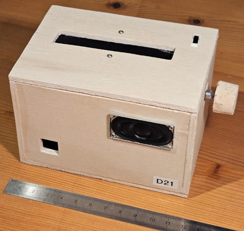
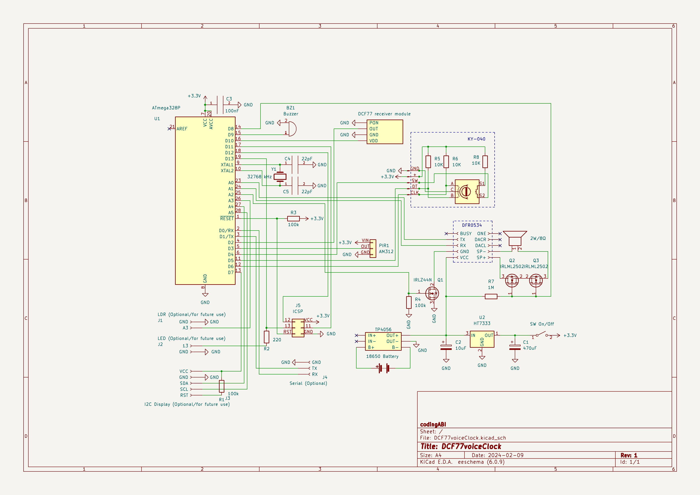
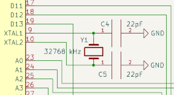
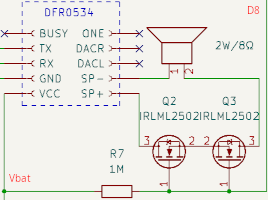
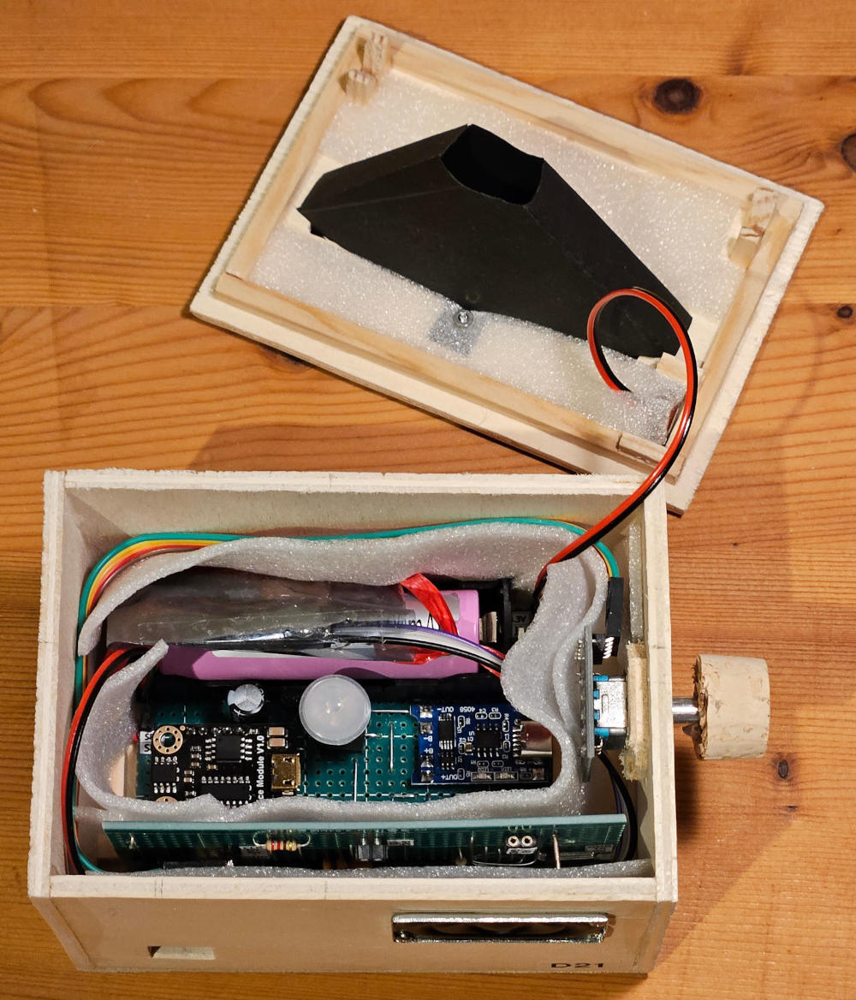
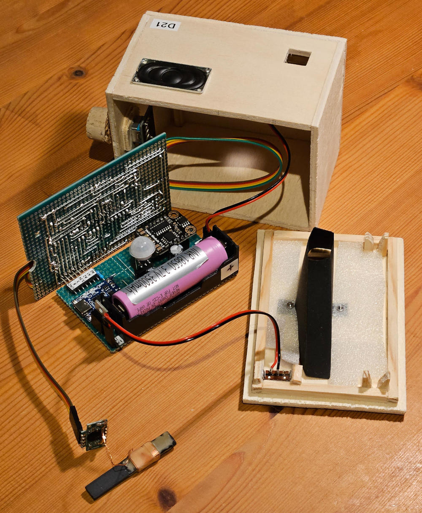
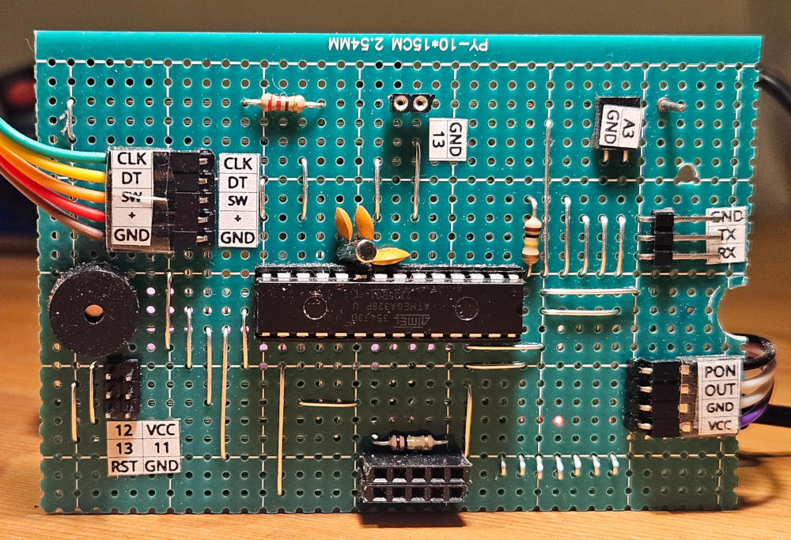

# DCF77voiceClock
*The DCF77voiceClock is on my bedside table and if I want to know the time at night without opening my eyes or saying anything, all I have to do is put my hand on or over the DCF77voiceClock and the time is announced to me.*

The DCF77voiceClock is a DIY clock without a display that speaks the current time acoustically when a motion is detected by a PIR sensor
- Device works offline (audio samples are stored locally on a MP3 module)
- Time can be synced by DCF77 (manually and once per day at 00:00)
- Time can be set manually
- Device runs on battery
- Device has no display and communicates only acoustically (also in menu or when changing settings)
- Audio samples for languages EN and DE ([all samples](assets/ZH) were created by a [powershell script](assets/makeAudioSamples.ps1) with the builtin speech synthesizer of a Microsoft Windows 11 computer)

Watch device on [Youtube](https://youtu.be/HLoVj9araNE)

## License and copyright
My code is licensed under the terms of the 2-Clause BSD License [Copyright (c) 2024 codingABI](LICENSE). 

### External code
I use external code in this project in form of libraries and two small
code piece called summertime_EU and getBandgap, but does not provide these code.

If you want to compile my project, you should be able to download the needed libraries

- Dusk2Dawn (by DM Kishi)
- DCF77 (by Thijs Elenbaas)
- Time (by Michael Margolis/Paul Stoffregen)

with the Arduino IDE Library Manager and the libraries

- DFR0534 (https://github.com/codingABI/DFR0534 by codingABI)
- SWITCHBUTTON (https://github.com/codingABI/SWITCHBUTTON by codingABI)
- KY040 (https://github.com/codingABI/KY040 by codingABI)

from github.

For details to get the small code pieces for

- summertime_EU "European Daylight Savings Time calculation by "jurs" for German Arduino Forum"
- getBandgap by "Coding Badly" and "Retrolefty" from the Arduino forum

see [externalCode.ino](DCF77voiceClock/externalCode.ino).

# Appendix

## Hardware
- Microcontroller ATmega328P (In 8 MHz-RC mode. Board manager: "ATmega328 on a breadboard (8 MHz internal clock)" )
- 32768 kHZ clock crystal for timer2 (Without a DCF77 sync time drifts ~8s per day)
- DCF-3850M-800 DCF77 time signal receiver
- Speaker 2 Watt, 8 Ohm
- AM312 PIR sensor
- DFR0534 audio module
- IRLZ44NPBF FET to power on/off the audio module
- 2xIRLML2502 FETs to disconnect speaker during audio module startup (avoid startup noise)
- Passive buzzer for simple audio signals
- KY-040 rotary encoder
- HT7333A 3.3V voltage regulator
- 3.7V 3500mA Li-Ion battery with a TC4056 as loader and protection

## Used development environment 
Arduino IDE 1.8.19 (Without "real portable" support version 2.* makes no sense for me https://forum.arduino.cc/t/arduino-ide-2-0-portable/)
Arduino AVR Boards Version 1.8.6

When you get compile error "multiple definition of `__vector_5'" comment out "ISR(PCINT2_vect, ISR_ALIASOF(PCINT0_vect));" in ...portable\packages\arduino\hardware\avr\1.8.6\libraries\SoftwareSerial\src\SoftwareSerial.cpp

## Notes
- The audio module DFR0534 consumes a lot of power (up to ~2W) and will be switched off when not needed
- During the menu system, the audio module DFR0534 is needed => Keep you menu actions short
- **Do not connect the DFR0534 module to USB without removing the DFR0534 module from the perfboard** because the DFR0534 module will connect 5V from USB to the TP4056 output and can break the TP4056 or other components 
- Do not connect ICSP-Vcc other than 3.3V (Better leave ICSP-Vcc unconnected)
- All audio samples has to be strored in the subfolder ZH on the DFR0534 audio module. Only the optional startup.mp3 is stored in the root folder
  
## Device behavior
- When the DCF77voideClock is powered on a DCF77 time sync is startet (and you can hear micro clicks for every reveived DCF77 signal)
- After first successful DCF77 time synchronization:
  - the synchronization will be repeated every day at 00:00
  - the current time will be announced acoustically if a motion is detected above the device  
  - rotating the knob changes the audio volume
  - pressing the knob will start the main menu

## Power consumption

- While waiting for a motion detection ~0.3mA@3.3V
- In main menu, volume control or time announcement 35-200mA@3.3V
- While daily DCF77 synchronisation ~2mA@3.3V (max for 15 minutes)

## Buzzer-Codes
| Buzzer | Meaning |
| :---  | :--- |
| Laser beep  | Begin of normal device start/power on |
| Micro clicks | When turning the knob or when receiving a DCF77 signal |
| 1x Short  | Main menu started |
| 2x Short  | Vcc voltage too high |
| 3x Short  | Low battery |

## Schematic

## Clock/Timer2

Normally we would need a RTC module to build an electronic clock, but in this project the ATmega328P acts like a RTC. The ATmega328P works in 8 MHz-RC mode without the need of an external crystal. A 32768 kHZ clock crystal is connected to the ATmega328P and is used to trigger timer2 once per second. I used 22pF capacitors for the compensation capacitors C4 and C5, because they worked and I had no other low value pF capacitors. 

With this schematic my ATmega328P drifts ~8s per day. This is OK for me, because DCF77voiceClock will start a DCF77 time synchronisation once per day and resets the drift.

## Speaker/Mute

The audio module DFR0534 consumes a lot of power (~30mA@3.3V when idle) and will be powered off when not needed via FET Q1. Everytime the audio module is powered on it produces an annoying noise. To prevent the noise the FETs Q2/Q3 can be used to disconnect/connect the speaker via pin D8, when needed (When D8 is LOW the speaker is disconnected. When D8 is set to INPUT-Mode the speaker is connected)

## Assembly

